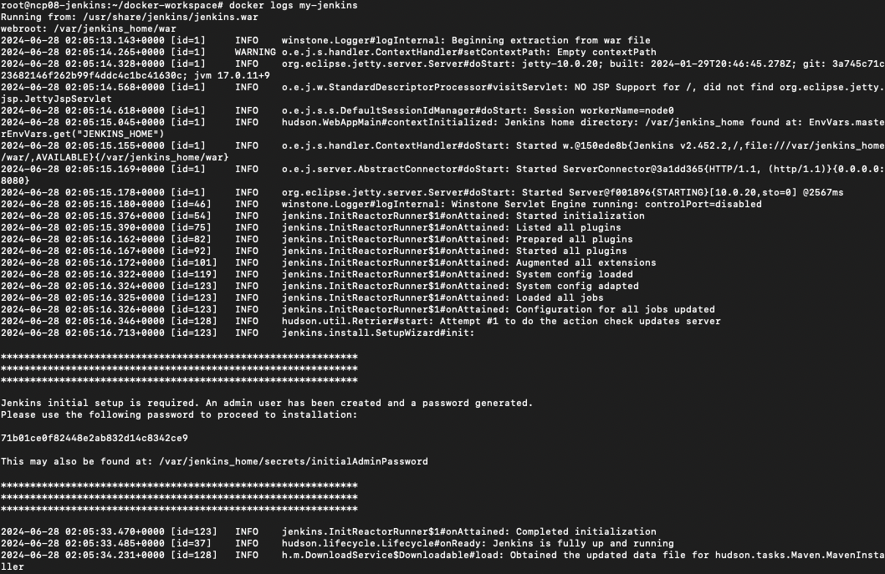

# Jenkins 사용법

## Jenkins 설치

### 네트워크 브릿지 생성

젠킨스 도커 컨테이너에서 사용할 브릿지 네트워크를 준비한다.

```
# docker network ls
# docker network create jenkins
# docker network ls
```

### 젠킨스 도커 컨테이너 생성 및 실행

젠킨스 도커 이미지 가져오기

```
# docker pull jenkins/jenkins:lts-jdk17
# docker image ls
```

#### 도커 이미지 만들기: 젠킨스 + JDK17 + 도커 클라이언트

작업 디렉토리 생성

```
# mkdir docker-workspace
# cd docker-workspace
```

install-docker.sh 파일 생성

```
# vi install-docker.sh
```

install-docker.sh 파일 내용

```shell
#!/bin/sh

apt-get update

apt-get -y install apt-transport-https \
     apt-utils \
     ca-certificates \
     curl \
     gnupg2 \
     zip \
     unzip \
     acl \
     software-properties-common

curl -fsSL https://download.docker.com/linux/$(. /etc/os-release; echo "$ID")/gpg > /tmp/dkey; apt-key add /tmp/dkey

add-apt-repository \
   "deb [arch=amd64] https://download.docker.com/linux/$(. /etc/os-release; echo "$ID") \
   $(lsb_release -cs) \
   stable" && \

apt-get update

apt-get -y install docker-ce
```

도커 빌드 파일 생성

```
# vi Dockerfile
```

Dockerfile 내용

```shell
FROM jenkins/jenkins:lts-jdk17

USER root

COPY install-docker.sh /install-docker.sh
RUN chmod +x /install-docker.sh
RUN /install-docker.sh

RUN usermod -aG docker jenkins
RUN setfacl -Rm d:g:docker:rwx,g:docker:rwx /var/run/

USER jenkins
```

도커 이미지 생성

```
# docker build -t golllldong/my-jenkins:1.0 .
```

도커 이미지를 도커 허브 사이트에 업로드 하기

```
# docker login
# docker push golllldong/my-jenkins:1.0
```

컨테이너 생성 및 실행하기

```
# docker run --privileged -d -v /var/run/docker.sock:/var/run/docker.sock -v jenkins_home:/var/jenkins_home -p 8080:8080 -p 50000:50000 --restart=on-failure --network="jenkins" --name my-jenkins golllldong/my-jenkins:1.0
# docker container ls
```

젠킨스 컨테이너를 재생성 할 때, 기존 젠킨스 볼륨을 제거하기

```
# docker volume ls
# docker volume rm jenkins_home
```

### 젠킨스 설정

젠킨스 잠금을 풀기 위해 관리자 암호 찾아서 넣기

```
# docker logs my-jenkins
```


젠킨스 플러그인 설치

```
"Install suggested plugins" 클릭
```

첫 번째 젠킨스 관리자 등록

```
계정명: jenkins
암호: 1111
암호확인: 1111
이름: jenkins
이메일주소: xxx@xxx.xxx
```

젠킨스 루트 URL 설정

```
http://서버주소:8080
```

젠킨스 사용 시작!

### 이건 안해도 상관 X
### jenkins:lts-jdk11을 사용한 경우 JDK 17 설치

root 사용자로 젠킨스 컨테이너에 접속하기

```
호스트# docker exec -itu 0 my-jenkins bash
컨테이너/# apt-get update
컨테이너/# apt-get install openjdk-17-jdk -y
이렇게 설치한 경우는 JAVA_HOME : /usr/lib/jvm/java-17-openjdk-amd64
```

(docker inspect my-jenkins 에서 확인 가능)

### 젠킨스에 JDK 17 경로 등록

- Jenkins 관리
  - Global Tool Configuration
    - JDK
      - 'Add JDK' 클릭
        - Name: `openjdk-17`
        - JAVA_HOME: `/opt/java/openjdk`
    - SAVE 클릭

### github.com의 프로젝트 연동

Dashboard

- 새로운 Item
  - Enter an item name: `myapp`
  - Freestyle project 클릭
  - OK 클릭
- 설정
  - General
    - 설명: `빌드 테스트1`
    - `GitHub project` 체크
      - Project url: `https://github.com/GollllDong/ncp-myapp.git`
  - 소스 코드 관리
    - `Git` 선택
      - Repository URL: `https://github.com/GollllDong/ncp-myapp.git`
      - Credentials:
        - Add 버튼 클릭: `Add Jenkins` 선택
        - `Username with Password` 선택
          - Username: 깃허브 사용자이름
          - Password: 깃허브 토큰
        - `Username/토큰` 선택
      - Branch Specifier: \*/main
  - 빌드 유발
    - `GitHub hook trigger for GITScm polling` 선택
  - Build Steps
    - `Invoke Gradle script` 선택
      - `Use Gradle Wrapper` 선택
        - `Make gradlew executable` 체크
        - Wrappter location: 비워둠
      - Tasks
        - `clean npmSetup appNpmInstall build`
        - 입력
  - 저장
- `지금 빌드` 클릭
  - Console Output 확인
  - `docker exec -itu 0 my-jenkins bash` 접속

### github webhook 연동

- Repository/Settings/Webhooks
  - `Add webook` 클릭
    - Payload URL: `http://젠킨스서버주소:8080/github-webhook/`
    - Content type: `application/json`
    - 저장

## Jenkins와 스프링부트 배포 서버 연동

### ssh key 생성

my-jenkins 도커 컨테이너에서 실행

```
root@jenkins-svr:~# ssh-keygen -t rsa -C "my-jenkins-key" -m PEM -P "" -f /root/.ssh/my-jenkins-key
root@jenkins-svr:~# ls .ssh/
my-jenkins-key  my-jenkins-key.pub
root@jenkins-svr:~# cat .ssh/my-jenkins-key.pub
ssh-rsa AAAAB3NzaC1yc2E...
```

### 스프링부트 배포 서버에 public key 등록

배포서버에서 vi 편집기 실행

```
root@springboot-svr:~# mkdir .ssh
root@springboot-svr:~# vi .ssh/authorized_keys
젠킨스서버의 공개키를 붙여 넣는다.
```

### Publish Over SSH 플러그인 설정

플러그인 설치

- Jenkins 관리
  - 플러그인 관리
  - `Available plugins` 탭
    - `Publish Over SSH` 플러그인 설치

플러그인 연동

- Jenkins 관리
  - 시스템 설정
    - Publish over SSH
      - Passphrase: 스프링부트서버 암호
      - 추가 버튼 클릭
      - SSH Servers
        - Name: 임의의서버 이름
        - Hostname: 스프링부트서버의 IP 주소
        - Username: 사용자 아이디
        - `Test Configuration` 버튼 클릭
          - `Success` OK!

### Jenkins 컨테이너 안에 도커 설치하기

젠킨스 컨테이너에 접속

```
# docker exec -itu 0 my-jenkins /bin/bash
기존에 도커 설치하는 것과 동일하게 설치
```

도커 데몬 실행
멧

```
컨테이너/# service docker start
컨테이너/# systemctl start docker  <=== 권한 문제 해결해야 실행됨
컨테이너/# /etc/init.d/docker start  <=== 직접 실행하기
```

### Jenkins & Docker 그룹 추가

Docker 그룹에 root 계정 있는지 검사

```
컨테이너/# id -nG
root docker   <=== 이렇게 출력되면 정상
```

만약 root 계정이 추가되지 않았다면

```
컨테이너/# usermod -aG docker root
```

docker.sock 권한 변경

```
컨테이너/# chmod 666 /var/run/docker.sock
```

docker 로그인하기

```
docker login
Username: hub.docker.com 사이트에 가입한 사용자 아이디
Password: 암호
...
Login Succeeded   <=== 이렇게 나오면 성공!
```

## Docker 를 활용해 Jenkins 서버에서 스프링부트 서버로 배포 자동화하기

docker 이미지 생성 및 도커 허브에 push 하기

- Dashboard
  - `myapp` Freestyle 아이템 선택
    - `구성` 탭 선택
      - Build Steps
        - `Add build step` : Execute shell 클릭
          - `docker login -u '도커허브아이디' -p '도커허브비번' docker.io`
          - `docker build -t [dockerHub UserName]/[dockerHub Repository]:[version] app/`
          - `docker push [dockerHub UserName]/[dockerHub Repository]:[version]`
        - 저장

스프링부트 서버에서 docker pull 및 run

- Dashboard
  - `myapp` Freestyle 아이템 선택
    - `구성` 탭 선택
      - 빌드 환경
        - `Send files or execute commands over SSH after the build runs` 선택
          - SSH Server Name: Publish over SSH에 등록한 서버를 선택
          - Transfers
            - Exec command
              - `docker login -u '도커허브아이디' -p '도커허브비번' docker.io`
              - `docker pull [dockerHub UserName]/[dockerHub Repository]:[version]`
              - `docker ps -q --filter name=[containerName] | grep -q . && docker rm -f $(docker ps -aq --filter name=[containerName])`
              - `docker run -d --name [containerName] -p 80:80 [dockerHub UserName]/[dockerHub Repository]:[version]`
